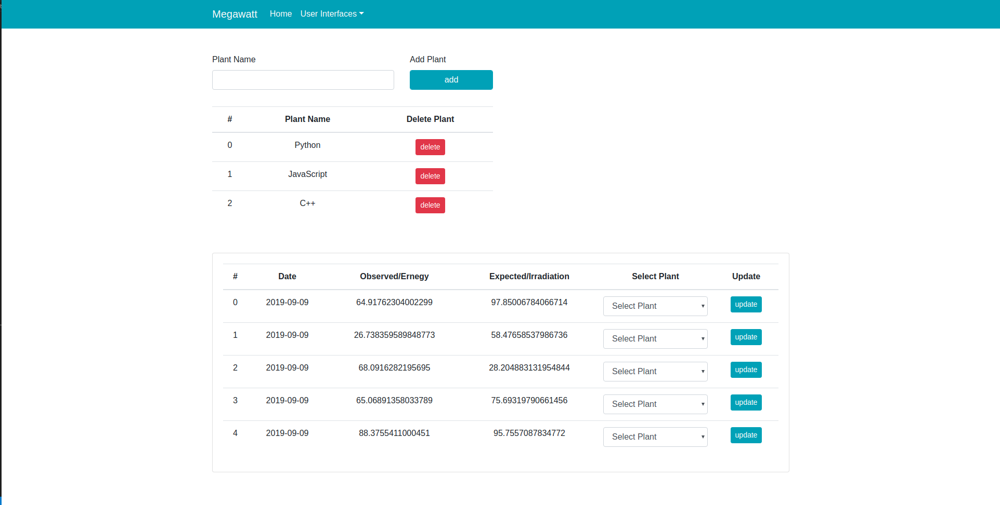
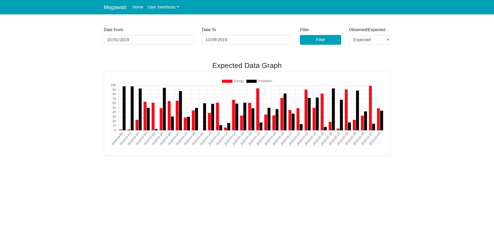

# Megawatt Solution 
===============

1. User Interface Screenshot

<p align="center">
   
</p> <br />

<p align="center">
  
</p>

2. Requirements

Requirements <br />
    : Linux Distro or Darwin  <br />
    : Note (for windows users your will need to review Makefile and change sudo priviledge) <br />
    : Docker <br />

Please note that every commmand you run will promp you to provide your password <br />

3. Clone Repo

Clone repository <br />
run command
```
    $ git clone https://github.com/reaganscofield/megawatt.git
```

Navigate to project directory

```
    $ cd megawatt
```

4. Setup Environment Variables

Back-End environment variables <br />

create file ".env" in root directory <br />

```
    $ touch .env
```
and add the below code in your .env file <br />
```
    DEBUG=True
    SECRET_KEY='auze%a^qyec-mvy^!9yg+(6zg#vpdgf_$#&q=1%)w5f(+l2v+h'
    CORS_ORIGIN_ALLOW_ALL=True

    DB_PORT=5432
    DB_HOST=postgres
    DB_PASSWORD=postgres
    DB_USER=postgres
    DB_NAME=megawatt
    DB_ENGINE=django.db.backends.postgresql_psycopg2

```

Front-END environment variables <br />

create file  "frontend_app/.env" in root directory <br />
```
    $ touch frontend_app/.env
```
and add the below code <br />
```
    REACT_APP_HOST_NAME=127.0.0.1
    REACT_APP_HOST_PORT=4700
```

5. Build and Install Dependencies

Build<br />
run command:
```
    $ make build
```

Run <br />
run command
```
    $ make run
```

6. Database Set up

Your can open your browser to access PGADMIN INTERFACE <br />

URL :  http://127.0.0.1:5558  <br />

now you can login to your PGADMIN INTERFACE with  <br />

email : pgadmin4@pgadmin.org <br />
password : admin <br />


Create PostgreSQL Server in your PGADMIN INTERFACE with <br />

name : postgres <br />
host : postgres <br />
port : 5432 <br />
username : postgres <br />
password : postgres <br />


Now Create Database <br />

name : megawatt <br />


Stop your docker images and run it again <br />
run command

```
    $ ctrl + c
```

```
    $ make run
```

Now Run Migrations Commands  <br />

Open new terminal in your root directory<br />
run command

```
    $ make migrations
```

if migrations run success skip this instructions inside #### tags if migrations did not run success please there is 
a problem with Background_Tasks third party package follow the instructions inside #### tags and re-run "make migrations"
then follow the rest of instructions outside of #### tags 


###########################################################################################################
1. Open your project in your IDE
2. go inside megawatt/settings.py
3. on line 31 INSTALLED_APPS please comment out back 'background_task' 
```
INSTALLED_APPS = [
    'background_task',      #"comment out this line"
    'django.contrib.admin',
    'django.contrib.auth',
    'django.contrib.contenttypes',
    'django.contrib.sessions',
    'django.contrib.messages',
    'django.contrib.staticfiles',
    'rest_framework',
    'backend_app',
    'corsheaders',
]
```

4. inside the same directory go to megawatt/urls.py
5. comment out line 18 comment out 'views.pull_from_monitoring_service()'
```
    views.pull_from_monitoring_service()  #"comment out this line"
```

6. go inside backend_app/views.py
7. comment out line 11 
```
    from background_task import background   #"comment out this line"
```

8. inside the same file go to line 20 "@background(schedule=60*60*24)"
9. comment out line 20
```
    @background(schedule=60*60*24)  #"comment out this line"
``` 

Now Re-Run Migrations 
run command <br />

```
    $ make migrations
```
if migrations run success please remove all the comment you have added and follow the rest of instructions outside of ### tags
###########################################################################################################


Migrate  <br />
run command

```
    $ make migrate
```

Run Your Application <br />
run command

```
    $ make run 
```

to generate some data to test with you might need to change periodic function decorate  
parameter from "60*60*24" to "60*2" and then run the bellow periodic command and wait for 2 minutes
after to minutes function will be called and it will auto pull data from hardcoded module and save
to PostgreSQL database <br />

inside  "backend_app/views.py" line 20

```
@background(schedule=60*60*24)  # change schedule value to two minnutes 60*2
def pull_from_monitoring_service():
    monitoring_data = hardcoded_data
    convert_to_valid_data = []

    for data in monitoring_data:
        _data = {
            "datetime": data['datetime'],
            "expected": json.dumps(data['expected']),
            "observed": json.dumps(data['observed'])
        }
        convert_to_valid_data.append(_data)

    for create in convert_to_valid_data:
        serializer = DataPointSerializer(data=create)
        if serializer.is_valid(raise_exception=True):
            obj = DataPoint.objects.create(
                datetime = serializer['datetime'].value,
                expected = serializer['expected'].value,
                observed = serializer['observed'].value
            )
            obj.save()
            print("Success Created: {}".format(obj.id))
        else:
            print('error ', serializer.errors)
```

For Periodic Task <br />

you need to run another command which will run periodic task <br />
in every 24 hours, in the same terminal open new terminal tab <br />
and run this command. <br />

```
    $ make task
```

Your Back-End Service is EXPOSE on 127.0.0.1:4700 <br />
Your Front-End Service is EXPOSE on 127.0.0.1:6099 <br />
Your Database Service is EXPOSE on 127.0.0.1:5558 <br />
Your Monitoring Service is EXPOSE on 127.0.0.1:5001 <br />
